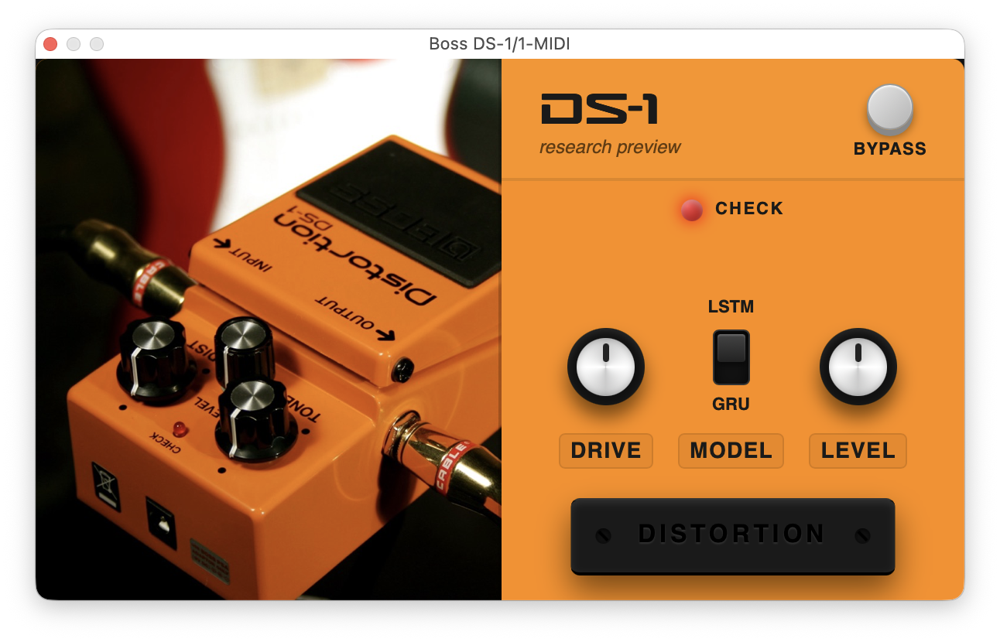

# Boss DS-1 Neural Emulation

Real-time neural emulation of the Boss DS-1 distortion pedal, comparing LSTM and GRU recurrent architectures trained on captured hardware recordings and deployed as a JUCE audio plugin. This is the accompanying codebase for a master's thesis.



## Overview

A Boss DS-1 was recorded through a matched dry/wet signal chain to create a training dataset. Two single-layer recurrent models (LSTM and GRU, both at hidden size 24) were trained to learn the nonlinear input/output behaviour of the pedal using a weighted ESR and DC loss.

The trained weights are exported as JSON and loaded at runtime by [RTNeural](https://github.com/jatinchowdhury18/RTNeural), a header-only C++ inference library. The plugin runs as AU, VST3, and Standalone and ships with an embedded React/Vite WebUI for its controls.

The thesis documents the full workflow: hardware signal chain, dataset capture, model architecture, training methodology, evaluation, and plugin design.

## Repository layout

```
.
├── model/      Python training pipeline (PyTorch, uv). Includes the CoreAudioML submodule.
├── plugin/     JUCE 8 C++ audio plugin with RTNeural inference and a React/Vite WebUI.
└── thesis/     LaTeX dissertation (chapters, appendices, bibliography).
```

## Trained models

Both models use the `SimpleRNN` architecture from CoreAudioML: a single recurrent layer with a skip connection, trained on 44.1 kHz mono audio.

| Model    | Unit type | Hidden size | Layers | Skip | Loss (ESR / DC)  |
|----------|-----------|-------------|--------|------|------------------|
| ds1-LSTM | LSTM      | 24          | 1      | 1    | 0.75 / 0.25      |
| ds1-GRU  | GRU       | 24          | 1      | 1    | 0.75 / 0.25      |

Trained weights are in `model/Results/ds1-{LSTM,GRU}/model.json`. The copies embedded in the plugin are at `plugin/Resources/Models/`.

## Plugin controls

| Control | Range      | Description                              |
|---------|------------|------------------------------------------|
| Drive   | ±20 dB     | Pre-gain applied before model inference  |
| Level   | ±20 dB     | Output level                             |
| Model   | LSTM / GRU | Switch between the two trained models    |
| Bypass  | on / off   | Hard bypass                              |

## Requirements

| Component | Requirement |
|-----------|-------------|
| Training  | Python 3.10+, [uv](https://docs.astral.sh/uv/) |
| Plugin    | CMake 3.15+, C++23 toolchain (Clang / GCC / MSVC), Node.js + npm |
| Thesis    | LaTeX distribution (pdflatex + bibtex) |

## Quickstart

### Clone (with submodule)

```bash
git clone git@github.com:sathira10/ds1-neural-emulation.git
cd ds1-neural-emulation
git submodule update --init --recursive
```

### Train a model

```bash
cd model
uv sync
uv run python script.py --device ds1 --file_name ds1 --load_config lstm32
```

See `model/Configs/` for available configurations

### Build the plugin

```bash
cd plugin
cmake -B build -S .
cmake --build build
```

CMake fetches JUCE 8 and RTNeural via CPM and invokes the WebUI build (`npm install && npm run build`) automatically. Requires `npm` on your PATH.

See [`plugin/AGENTS.md`](plugin/AGENTS.md) for build options and [`plugin/CLAUDE.md`](plugin/CLAUDE.md) for the plugin architecture.

### Build the thesis

```bash
cd thesis
pdflatex main.tex
bibtex main
pdflatex main.tex
pdflatex main.tex
```

## Credits

- [CoreAudioML](https://github.com/Alec-Wright/CoreAudioML) by Alec Wright (training framework and model architecture)
- [RTNeural](https://github.com/jatinchowdhury18/RTNeural) by Jatin Chowdhury (real-time C++ inference)
- [JUCE](https://juce.com/) (audio plugin framework)
